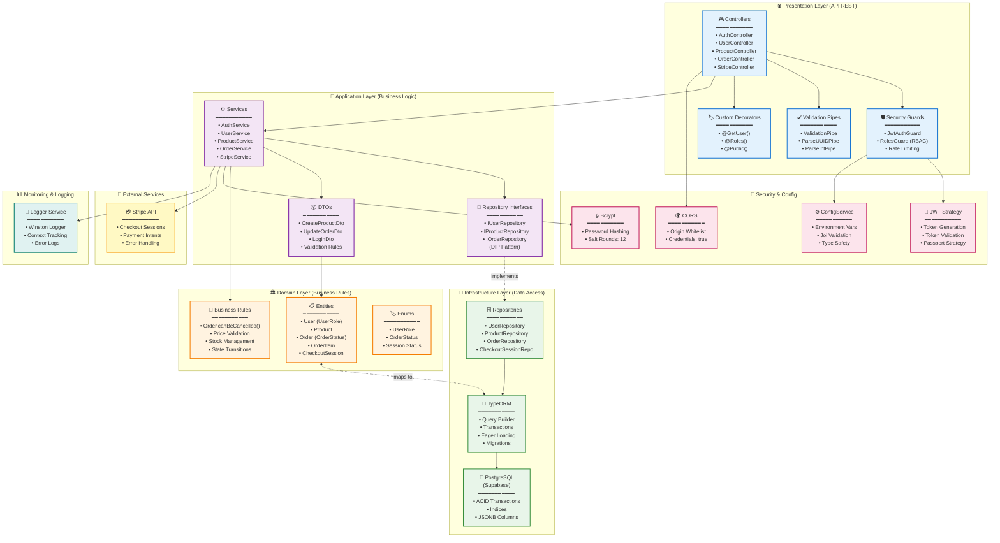

# QuickCart E-commerce Backend

## Descripción

API RESTful robusta para plataforma de e-commerce desarrollada con tecnologías empresariales modernas. Implementa principios de Clean Architecture, SOLID y estándares de seguridad OWASP.

## 🛠️ Stack Tecnológico

- **Framework:** NestJS 10.x con TypeScript
- **ORM:** TypeORM con PostgreSQL
- **Seguridad:** JWT, bcrypt, validación de esquemas
- **Documentación:** Swagger/OpenAPI
- **Testing:** Jest con cobertura >80%

## ✨ Características

### Arquitectura

- **Clean Architecture** con separación de capas
- **Repository Pattern** para abstracción de datos
- **Dependency Injection** con IoC container
- **SOLID Principles** aplicados consistentemente



### Seguridad

- Autenticación JWT con refresh tokens
- Autorización basada en roles (RBAC)
- Validación exhaustiva de entrada de datos
- Rate limiting y headers de seguridad
- Cumplimiento OWASP Top 10

## 🏗️ Estructura del Proyecto

```
src/
├── domain/           # Entidades y lógica de negocio
├── application/      # Casos de uso y DTOs
├── infrastructure/   # Implementaciones externas
└── shared/           # Utilidades compartidas
```

## 🚀 Instalación y Desarrollo

### Requisitos Previos

- Node.js 18+
- PostgreSQL 15+
- npm 9+

### Configuración

```bash
# Instalar dependencias
npm install

# Configurar variables de entorno
cp .env.example .env
# Editar .env con tu configuración

# Ejecutar migraciones
npm run migration:run

# Iniciar servidor de desarrollo
npm run start:dev
```

### Variables de Entorno

Configurar en archivo `.env`:

```env
NODE_ENV=development
PORT=3000
DATABASE_URL=postgresql://localhost/quickcart_db
JWT_SECRET=your-secret-key
JWT_EXPIRES_IN=24h
```

## 🧪 Testing

```bash
# Tests unitarios
npm run test

# Tests E2E
npm run test:e2e

# Cobertura
npm run test:cov
```

## 📚 Documentación API

- **Swagger UI:** `http://localhost:3000/api/docs`
- **Health Check:** `http://localhost:3000/api/v1`

## 📋 Scripts Disponibles

| Script          | Descripción               |
| --------------- | ------------------------- |
| `start:dev`     | Desarrollo con hot-reload |
| `build`         | Compilar para producción  |
| `start:prod`    | Ejecutar en producción    |
| `test`          | Ejecutar tests            |
| `lint`          | Análisis de código        |
| `migration:run` | Ejecutar migraciones      |

## 🔄 Flujo de Desarrollo

1. Crear rama feature desde `main`
2. Implementar cambios con tests
3. Verificar cobertura >80%
4. Pull request con revisión de código
5. Merge después de aprobación

### Convenciones

- **Commits:** Conventional Commits (`feat:`, `fix:`, `docs:`)
- **Código:** ESLint + Prettier configurados
- **Naming:** camelCase variables, PascalCase clases

---

_Construido con 💚 para ofrecer la mejor experiencia de e-commerce_
